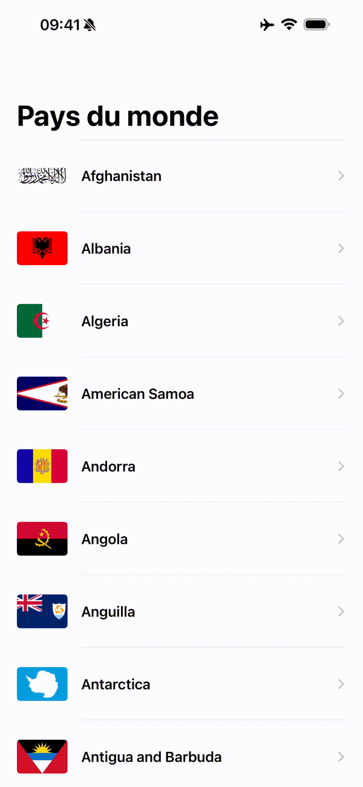

# Countries - Test Technique iOS

Application iOS en Swift/SwiftUI qui affiche la liste des pays du monde en utilisant l'API [REST Countries](https://restcountries.com/).

### 🎥 Demo



## 📱 Fonctionnalités

- ✅ Affichage de la liste de tous les pays avec nom et drapeau
- ✅ Navigation vers les détails d'un pays
- ✅ Affichage des détails : capitale, continent, population
- ✅ Gestion complète des erreurs
- ✅ Indicateurs de chargement
- ✅ Pull-to-refresh
- ✅ Tests unitaires

## 🏗️ Architecture

### Choix d'architecture : **MVVM + Repository Pattern + Clean Architecture**

```
┌─────────────────────────────────────────────────────────┐
│                  Presentation Layer                      │
│  ┌──────────────┐              ┌──────────────┐        │
│  │    Views     │ ←─────────── │  ViewModels  │        │
│  │  (SwiftUI)   │              │  (@Observable)│        │
│  └──────────────┘              └──────────────┘        │
└─────────────────────────────────────────────────────────┘
                        ↓
┌─────────────────────────────────────────────────────────┐
│                    Domain Layer                          │
│              ┌──────────────────┐                       │
│              │  Business Models │                       │
│              │    (Country)     │                       │
│              └──────────────────┘                       │
└─────────────────────────────────────────────────────────┘
                        ↓
┌─────────────────────────────────────────────────────────┐
│                     Data Layer                           │
│  ┌──────────────┐              ┌──────────────┐        │
│  │  Repository  │ ────────────→│    Network   │        │
│  │  (Protocol)  │              │   Service    │        │
│  └──────────────┘              └──────────────┘        │
│         ↓                                                │
│  ┌──────────────┐                                       │
│  │     DTOs     │  (Mapping to Domain Models)          │
│  └──────────────┘                                       │
└─────────────────────────────────────────────────────────┘
```

#### Justifications

**1. MVVM (Model-View-ViewModel)**
- ✅ Standard iOS moderne, fonctionne naturellement avec SwiftUI et `@Observable`
- ✅ Séparation claire entre logique métier et UI
- ✅ Facilite les tests (ViewModels testables sans UI)

**2. Repository Pattern**
- ✅ Abstraction de la source de données via un protocol
- ✅ Permet de mocker facilement pour les tests
- ✅ Facilite le changement de source de données (cache, API différente, etc.)

**3. Clean Architecture (Couches)**
- ✅ **Presentation** : Views + ViewModels (dépend de Domain)
- ✅ **Domain** : Modèles métier simples (aucune dépendance)
- ✅ **Data** : Repository + Network + DTOs (dépend de Domain)

**4. DTO Pattern (Data Transfer Objects)**
- ✅ Séparation entre modèles API (DTOs) et modèles métier (Domain)
- ✅ L'API peut changer sans impacter le reste de l'app
- ✅ Modèles métier simplifiés et adaptés aux besoins

**5. Dependency Injection**
- ✅ ViewModels reçoivent le Repository via constructeur
- ✅ Repository reçoit le NetworkService via constructeur
- ✅ Facilite les tests et découple les composants

## ❌ Gestion des Erreurs

### Approche Multi-Niveaux

#### 1. Erreurs Typées
```swift
enum NetworkError: LocalizedError {
    case invalidURL
    case noData
    case decodingError(Error)
    case serverError(Int)
    case networkError(Error)
    case unknown
}
```

**Avantages :**
- Type-safe : le compilateur garantit qu'on gère tous les cas
- Messages localisés en français pour l'utilisateur
- Suggestions de récupération incluses

#### 2. Result Type
```swift
func fetchAllCountries() async -> Result<[Country], NetworkError>
```

**Avantages :**
- Pattern Swift standard
- Force à gérer les cas de succès ET d'échec
- Composable et testable

#### 3. États UI
```swift
enum LoadingState<T> {
    case idle
    case loading
    case success(T)
    case failure(NetworkError)
}
```

**Avantages :**
- État UI clairement défini
- Impossible d'être dans un état incohérent
- Facilite le switch exhaustif dans les vues

#### 4. UI d'Erreur
- Vue d'erreur dédiée avec icône, message et bouton "Réessayer"
- Messages clairs et en français
- Suggestions de récupération (vérifier connexion, etc.)

## 🧪 Tests Unitaires

### Stratégie de Tests

#### Tests des ViewModels (Priorité HAUTE)
**Fichier:** `CountryListViewModelTests.swift`

Tests couverts :
- ✅ Chargement réussi des pays
- ✅ Gestion d'erreur réseau
- ✅ État de loading pendant le chargement
- ✅ État initial (idle)
- ✅ Fonction retry après échec
- ✅ Propriétés calculées (`countries`, `errorMessage`, `isLoading`)

**Technique :** Mock Repository pour isoler le ViewModel

#### Tests du Repository (Priorité MOYENNE)
**Fichier:** `CountryRepositoryTests.swift`

Tests couverts :
- ✅ Récupération réussie des pays
- ✅ Erreur réseau
- ✅ Erreur de décodage JSON
- ✅ Mapping DTO → Domain Model
- ✅ Gestion des champs optionnels manquants
- ✅ Formatage de la population

**Technique :** Mock Network Service pour isoler le Repository

#### Mocks Créés
- `MockCountryRepository` : Simule le repository avec succès/échec/délai
- `MockNetworkService` : Simule le service réseau avec données/erreurs

### Coverage
- ✅ Tous les cas critiques couverts
- ✅ Tests rapides (pas de vraies requêtes réseau)
- ✅ Tests déterministes et fiables
- ✅ Facilite la détection de régressions

## 📁 Structure du Projet

```
Countries/
├── App/
│   └── CountriesApp.swift                       # Point d'entrée @main
│
├── Core/
│   └── Network/
│       ├── NetworkError.swift                   # Erreurs typées + messages FR
│       └── NetworkService.swift                 # Service HTTP générique
│
├── Data/
│   ├── DTOs/
│   │   └── CountryDTO.swift                     # Modèles API + mapping
│   └── Repositories/
│       ├── CountryRepositoryProtocol.swift      # Protocol du repository
│       └── CountryRepository.swift              # Implémentation
│
├── Features/
│   ├── CountryList/
│   │   ├── Models/
│   │   │   └── Country.swift                    # Modèle domaine (simple)
│   │   ├── ViewModels/
│   │   │   └── CountryListViewModel.swift       # ViewModel avec @Observable
│   │   └── Views/
│   │       ├── CountryListView.swift            # Vue principale liste
│   │       ├── CountryRowView.swift             # Composant ligne
│   │       └── ErrorView.swift                  # Vue d'erreur réutilisable
│   │
│   └── CountryDetail/
│       └── Views/
│           ├── CountryDetailView.swift          # Vue détails
│           └── CountryDetailRowView.swift       # Composant détail row
│
└── CountriesTests/
    ├── ViewModelTests/
    │   └── CountryListViewModelTests.swift      # 8 tests du ViewModel
    ├── RepositoryTests/
    │   └── CountryRepositoryTests.swift         # 5 tests du Repository
    └── MockServices/
        ├── MockCountryRepository.swift          # Mock pour tests ViewModel
        └── MockNetworkService.swift             # Mock pour tests Repository
```

**Total fichiers Swift:** 18 (13 app + 5 tests)
**Total tests unitaires:** 13 tests

## 🚀 Comment Compiler et Exécuter

### Prérequis
- Xcode 15.0+
- iOS 17.6+
- Swift 5.9+

**Compiler :**
   ```
   ⌘ + B  (Build)
   ⌘ + R  (Run)
   ⌘ + U  (Run Tests)
   ```

### ✅ Architecture
- Clean Architecture avec séparation des responsabilités
- MVVM pour la couche présentation
- Repository Pattern pour l'abstraction des données
- Dependency Injection pour la testabilité

### ✅ Gestion d'Erreurs
- Erreurs typées avec `LocalizedError`
- Result Type pour gérer succès/échec
- UI adaptée avec messages clairs
- Retry functionality

### ✅ Tests Unitaires
- Tests des ViewModels avec mocks
- Tests du Repository avec mocks
- Tests du mapping DTO → Domain
- Coverage des cas critiques

## 🎨 Choix Techniques

### Async/Await + @Observable (Swift Moderne)

**Architecture 100% moderne : Async/Await + @Observable**

- ✅ **Async/await** pour toute la logique asynchrone (réseau, repository)
- ✅ **@Observable** (nouveau macro Swift 5.9) pour l'observation UI
- ✅ **Zéro Combine** - Pas de @Published, Publishers, ou Subscribers

### Cache URLSession Natif

L'app utilise le cache URLSession par défaut, ce qui offre plusieurs avantages:

- ✅ **Mode offline** : Les données restent disponibles après le premier chargement
- ✅ **Performance** : Pas de requête réseau à chaque ouverture
- ✅ **UX améliorée** : Chargement instantané depuis le cache

**Pour tester la gestion d'erreur :**
- Supprimer l'app du simulateur et activer le mode avion AVANT le premier lancement
